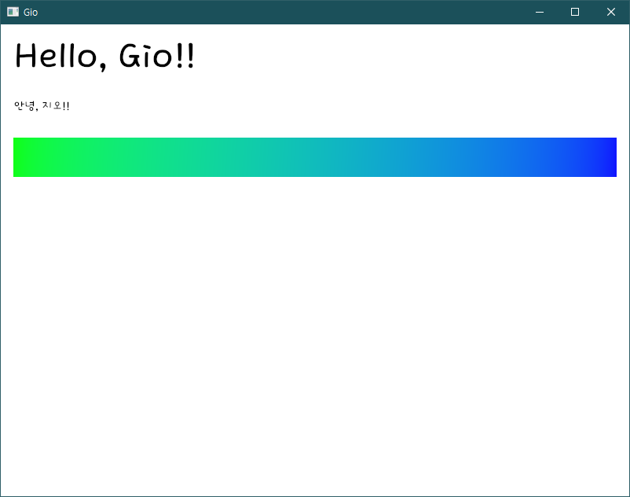

# [Gio](https://gioui.org/) practices



## Copied from
* [gio-example/kitchen](https://git.sr.ht/~eliasnaur/gio-example/tree/main/item/kitchen/kitchen.go)

## Run
```sh
$ cd pr01-layout
$ go run ./main.go
```

## Font
```go
....

once.Do(func() {
		// register(text.Font{}, goregular.TTF)

		ttfBytes, err := ioutil.ReadFile("./fonts/dongdong.ttf")

		if err != nil {
			log.Fatal(err)
		}
		register(text.Font{}, ttfBytes)

....
```

For CJK showing, Changed font from `gioui.org/font/gofont` to `giofont`
